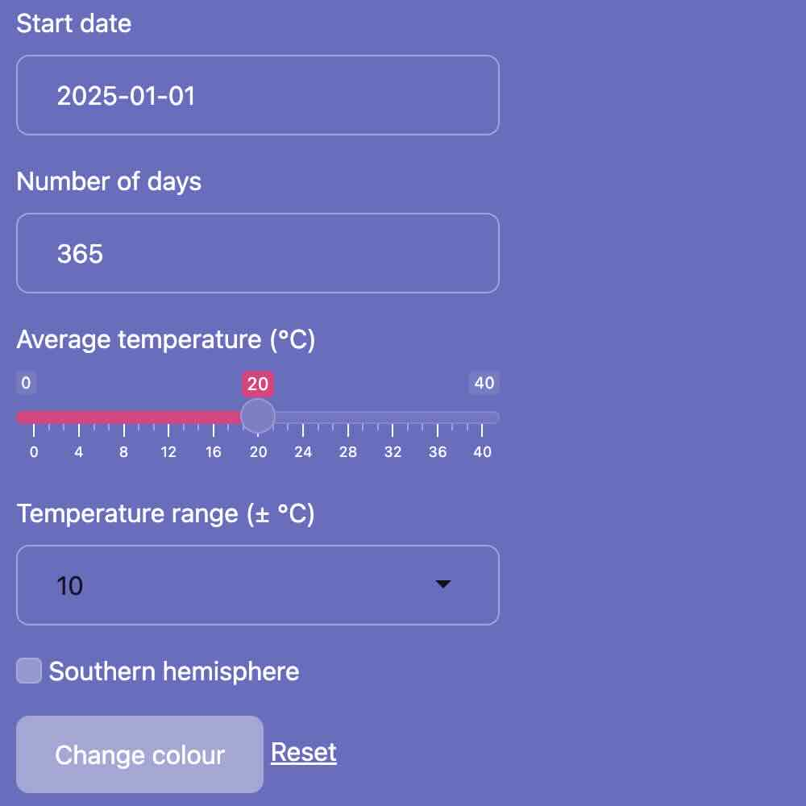

```{r, include = FALSE}
knitr::opts_chunk$set(
  collapse = TRUE,
  comment = "#>"
)
```

`inshiny` provides a basic set of compact Shiny input widgets that are
designed to be displayed within surrounding text without breaking the
spacing between lines. You can use `inshiny` to integrate Shiny input
within text paragraphs, or just to get user input for your Shiny app
without taking up as much space on the page compared to standard Shiny
inputs.

By default, Shiny uses [Bootstrap 3](https://getbootstrap.com/docs/3.4/)
for layouts and styling. `inshiny` requires [Bootstrap
5](https://getbootstrap.com/docs/5.3/getting-started/introduction/),
which just means that you will need to use the `bslib` package (which
enables updating to Bootstrap 5) in addition to `shiny` for `inshiny` to
work.

```{r, message = FALSE}
library(shiny)
library(bslib)
library(inshiny)
```

To use Bootstrap 5, when building your UI, you should use one of
`bslib`'s page layout functions instead of Shiny's built-in page
layouts. In other words, use

-   `bslib::page()` instead of `shiny::basicPage()` or `bootstrapPage()`
-   `page_fluid()` instead of `fluidPage()`
-   `page_fixed()` instead of `fixedPage()`
-   `page_fillable()` instead of `fillPage()`
-   `page_sidebar()` instead of `sidebarLayout()` within `fluidPage()`
-   `page_navbar()` instead of `navbarPage()`.

You should also set a theme using `bslib::bs_theme()`; this allows you
to specify `version = 5` so that your app will continue to use Bootstrap
5 even after Bootstrap 6 is released and `bslib` starts to support it.
(We may add support for Bootstrap 6 to `inshiny` in the future, but
better to make sure your app stays future-proof either way!)

All `inshiny` widgets should be wrapped in a call to `inline()`, which
creates a "paragraph" or "line" of text in which you can mix in widgets
and arbitrary HTML elements. You can then use widgets such as
`inline_text()` or `inline_slider()` within this element. Here is a
simple demo of a Shiny UI that uses most of the widgets provided by
`inshiny`:

```{r}
ui <- page_fixed(
    theme = bs_theme(version = 5, preset = "quartz"),

    h1("Temperature plot"),

    plotOutput("plot", width = 480, height = 320),

    br(),

    inline("Start on ", inline_date("start_date", "2025-01-01"),
        " and plot for ", inline_number("num_days", 365), " days."),

    inline("Average temperature: ", inline_slider("avg_temp", 20, 0, 40),
        " °C. Range: ±", inline_select("temp_range", c(5, 10, 15), 10), " °C."),

    inline("Hemisphere: ", inline_switch("southern", FALSE,
        on = "Southern", off = "Northern")),

    inline(inline_button("colour", "Change colour"), " ",
        inline_link("reset", "Reset"))
)
```

The page starts with a title (`h1`) and a `shiny::plotOutput()` that
we'll use to plot average temperatures according to the settings below.
There's a line break (`br`) to space things out, then four `inline`
lines containing the `inline_*` widgets provided by `inshiny`. It looks
something like this:

{width="450"}

Compare this to a similar layout with basic Shiny inputs:

```{r}
ui <- page_fixed(
    theme = bs_theme(version = 5, preset = "quartz"),

    h1("Temperature plot"),

    plotOutput("plot", width = 480, height = 320),

    br(),

    dateInput("start_date", "Start date", "2025-01-01"),
    numericInput("num_days", "Number of days", 365),
    sliderInput("avg_temp", "Average temperature (°C)", 0, 40, 20),
    selectInput("temp_range", "Temperature range (± °C)", c(5, 10, 15), 10),
    checkboxInput("southern", "Southern hemisphere", FALSE),
    actionButton("colour", "Change colour"),
    actionLink("reset", "Reset"),
)
```

The controls for this version take up far more space:

{width="450"}

Of course, you could save some vertical space by laying out the elements
in a grid, but they are still rather large compared to the `inshiny`
widgets.

We complete the app using server code to handle the inputs:

```{r}
server <- function(input, output, session)
{
    output$plot <- renderPlot({
        date <- input$start_date + seq_len(input$num_days) - 1;
        xpts <- as.POSIXlt(date)$yday; # day number, 0-365
        temperature <- cos(2 * pi * xpts / 364) *
            ifelse(input$southern, 1, -1) * as.numeric(input$temp_range) +
            input$avg_temp;
        oldpar <- par(mar = c(5, 5, 1, 2))
        plot(date, temperature, type = "l", ylim = c(-15, 55),
            col = input$colour %% 16 + 1, lwd = 3)
        abline(h = 0, col = 8, lty = 2)
        par(oldpar)
    })

    observeEvent(input$reset, {
        update_inline("start_date", value = "2025-01-01")
        update_inline("num_days", value = 365)
        update_inline("avg_temp", value = 20)
        update_inline("temp_range", value = "10")
        update_inline("southern", value = FALSE)
    })
}
```

This illustrates the use of `update_inline()` to reset the widgets to
their original values. You would then launch the app with
`shinyApp(ui, server)`.
